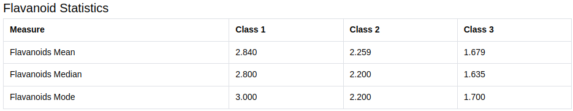
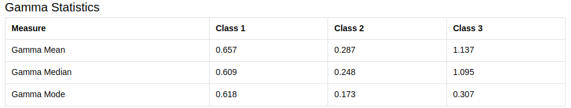

# Wine Data Set Statistical Analysis

This project aims to perform statistical analysis on the Wine Data Set and display the calculated measures as tables using React with Create React App and Mantine v7. The analysis includes calculating class-wise mean, median, and mode for "Flavanoids" and "Gamma" properties of the dataset.

## Instructions to Run the Project

1. Clone this repository to your local machine.
2. Ensure you have Node.js and Yarn installed on your machine.
3. Navigate to the project directory in your terminal.
4. Install project dependencies by running `yarn install`.
5. Start the development server by running `yarn start`.
6. The browser should automatically open with the application running. If not, navigate to `http://localhost:3000` in your browser.

## Project Structure

```
|-- /src
|   |-- /components
|   |   |-- FlavanoidsStatistics.tsx
|   |   |-- GammaStatistics.tsx
|   |   |-- App.tsx
|   |-- /data
|   |   |-- wine_data.json
|   |-- /utils
|   |   |-- statistics.ts
|-- /node_modules
|-- README.md
|-- package.json
|-- tsconfig.json
```

## Statistical Analysis

### Flavanoids Statistics

The `FlavanoidsStatistics.tsx` component calculates and displays class-wise mean, median, and mode of Flavanoids using Mantine v7's `Table` component.

### Gamma Statistics

The `GammaStatistics.tsx` component calculates and displays class-wise mean, median, and mode of Gamma using Mantine v7's `Table` component.

## Screenshots




For any queries or assistance, feel free to reach out!
